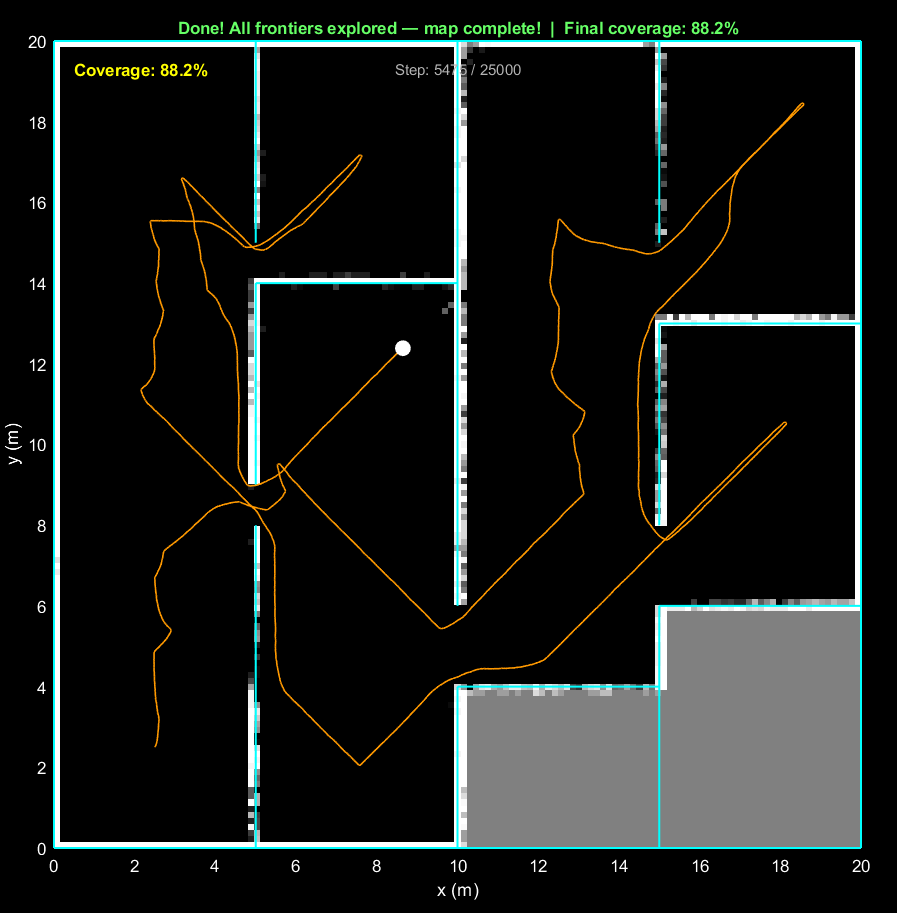

# Module 08 — Frontier-Based Autonomous Exploration

The first module where I didn't tell the robot where to go at all.

Every previous module had goal selection — either I clicked a point or hardcoded a patrol route. Here the robot decides for itself where to explore next, navigating to the edges of what it has already seen until there's nothing unknown left. It finished at **88.2% coverage in 5475 steps** — well under a quarter of the step budget — and terminated cleanly when it ran out of reachable frontiers.



---

## The core idea

An occupancy grid has three cell states: **free**, **occupied**, and **unknown**. A **frontier** is any free cell that borders at least one unknown cell — the boundary between the mapped world and the unmapped world. Navigate to frontiers, map the new area, find new frontiers, repeat until none remain.

It's a surprisingly elegant loop. The robot never backtracks on purpose — exploration falls out naturally from the algorithm structure.

---

## Frontier selection: hybrid scoring

The robot doesn't just go to the nearest frontier. It uses a hybrid score balancing **travel cost** against **information gain**:

```
score = frontier_size / distance_to_centroid
```

A frontier with 40 cells at 3 m away scores the same as one with 20 cells at 1.5 m. In practice this means the robot prefers large unexplored regions over small nooks, but won't ignore a big region forever just because it's far — as the robot moves closer, the distance drops and the score rises naturally.

Frontier segments are found by:
1. Dilating the unknown mask and ANDing with free cells to find frontier cells
2. Running 4-connected `bwconncomp` to cluster contiguous cells into segments
3. Computing each segment's centroid and size

---

## Why no EKF landmarks?

Earlier modules used EKF SLAM with point landmarks. That approach doesn't work well for wall-heavy environments: every LiDAR beam hitting a straight wall creates a new "landmark", flooding the EKF with hundreds of closely-spaced points along each corridor before the robot even moves. The O(n_landmarks) inner loop also becomes extremely slow.

Walls are line features, not point landmarks. The occupancy grid already captures all the spatial structure needed for exploration and planning — dead-reckoning + occupancy grid is the right model here.

---

## Pipeline each step

```
Move robot (pure pursuit on current path)
    ↓
Add odometry noise (dead-reckoning)
    ↓
Simulate 2D LiDAR (ray casting vs wall segments)
    ↓
Update occupancy grid (log-odds + Bresenham trace)
    ↓
Every 40 steps:
    Detect frontier cells → cluster → hybrid score
    Blacklist check → select best reachable frontier
    nearest_free_cell() → A* → pure pursuit path
    ↓
Terminate: no frontiers left  OR  25 000 steps
```

---

## Stuck recovery

Two mechanisms prevent the robot from looping:

**Stuck counter** — if the robot makes no progress toward its target for 40 steps, it blacklists that frontier centroid and picks the next-best one.

**Frontier blacklist** — failed targets are recorded with a 500-step expiry. The scorer gives them zero so they won't be selected again until the timer expires (or until all frontiers are blacklisted, at which point the list clears).

**Free-cell start** — dead-reckoning drift can walk the estimated position into an inflated obstacle cell, which causes A* to immediately return no path. `nearest_free_cell.m` spirals outward from the robot's grid cell until it finds a free cell to use as the A* start, recovering cleanly from drift.

---

## What's on screen

| Element | Colour | Meaning |
|---------|--------|---------|
| Grid | White → grey → black | Free → unknown → occupied |
| Orange trail | — | Robot path history |
| Cyan walls | — | True world walls |
| White dot | — | Robot current pose |
| Green dashed | — | Planned A* path to target |
| Cyan diamonds | — | All detected frontier centroids |
| Magenta star | — | Active exploration target |
| Yellow text | — | Coverage percentage |

---

## Files

| File | What it does |
|------|-------------|
| `frontier_exploration_main.m` | Full pipeline — run this |
| `frontier_detector.m` | Detects, clusters, and returns frontier list |
| `nearest_free_cell.m` | Spiral search for nearest non-occupied grid cell |
| `astar_planner.m` | 8-connected A* (copy from Module 06) |
| `pure_pursuit.m` | Pure-pursuit path tracker (copy from Module 07) |
| `save_exploration_gif.m` | R2024a-compatible GIF export |

---

## Key parameters

| Parameter | Value | Effect |
|-----------|-------|--------|
| `GRID_RES` | 0.15 m/cell | Grid resolution |
| `FRONTIER_INTERVAL` | 40 steps | How often to recompute frontiers |
| `MIN_FRONTIER_SIZE` | 3 cells | Filter tiny spurious segments |
| `STUCK_LIMIT` | 40 steps | How quickly to bail on a stuck target |
| `BLACKLIST_TTL` | 500 steps | How long a failed target stays blacklisted |
| `INFLATE_R` | 2 cells | Obstacle inflation for A* |
| `LOOKAHEAD` | 0.45 m | Pure pursuit lookahead |
| `LIDAR_RANGE` | 5.0 m | Max sensor range |
| `LIDAR_NBEAMS` | 60 | Beams per scan |

---

## How it connects to the series

```
Occupancy Grid (04)   → same log-odds model, same Bresenham traces
A* Planner (06)       → astar_planner.m reused directly
Pure Pursuit (07)     → pure_pursuit.m reused directly
Frontier detect (08)  → NEW: bwconncomp clustering on free/unknown boundary
Hybrid scoring (08)   → NEW: size / distance frontier selector
Stuck recovery (08)   → NEW: blacklist + nearest_free_cell drift correction
```

---

## Things I learned

**Landmark-based SLAM is the wrong model for corridors.** The EKF landmark approach that worked in earlier modules completely breaks down here — straight walls generate hundreds of "unique" point landmarks per room, saturating the budget before the robot leaves the first corridor. Switching to pure dead-reckoning + occupancy grid made the simulation roughly 30× faster and actually more stable.

**The stuck recovery needed more layers than expected.** The first version just had a stuck counter. That wasn't enough — the robot would bail, pick the next frontier, plan a path, and immediately get stuck again because its estimated position had drifted into a wall. Adding `nearest_free_cell` to snap the A* start to the nearest valid cell fixed the cascading failure.

**88% is about right for this maze.** The remaining 12% grey in the bottom-right corner is structurally unreachable — the rooms there have no navigable entrance within the inflated obstacle radius. The algorithm correctly identified that no frontiers were reachable and terminated rather than spinning forever.

---

## Requirements

- MATLAB R2024a
- Image Processing Toolbox (`bwconncomp`, `imdilate`, `strel`)

---

## Run it

```matlab
cd 08_frontier_exploration
frontier_exploration_main
```

Robot starts at (2.5, 2.5) heading NE. Exploration terminates when no reachable frontiers remain or after 25 000 steps. Screenshot saved to `results_media/frontier_exploration.png`.