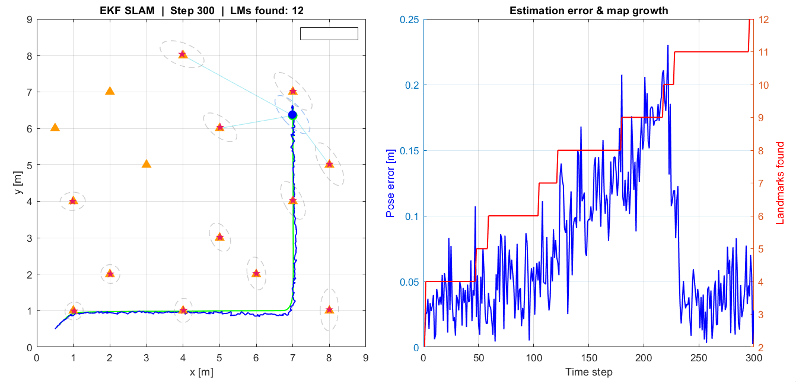
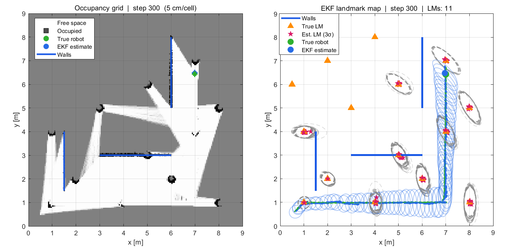

# 2D LiDAR SLAM — From a Kalman Filter to ROS 2



I built this project to actually understand how robots figure out where they are while simultaneously building a map of their surroundings — the classic SLAM problem. Started from scratch in MATLAB, ended up with a live ROS 2 pipeline running in RViz2. Here's how it went.

---

## The idea

I kept watching Brian Douglas's Autonomous Navigation series and wanted to go beyond just following along. So I decided to implement each algorithm myself, debug it, break it, fix it, and only move to the next one once I genuinely understood what was happening under the hood.

Five modules later, here we are.

---

## What's in here

### 01 — EKF SLAM
The foundation. A simulated differential-drive robot drives around a 2D environment with 15 landmarks, using a virtual LiDAR to sense them. The Extended Kalman Filter jointly tracks the robot's pose and every landmark position in one big state vector that grows as new landmarks are discovered.

The most satisfying moment was watching the covariance ellipses shrink in real time as the robot re-observed landmarks it had already seen. That's the filter gaining confidence — and it's beautiful to watch.



```
State vector: [x, y, θ, m₁ₓ, m₁ᵧ, …, m₁₅ₓ, m₁₅ᵧ]
Final dimension: 33  (3 robot + 15×2 landmarks)
Final pose error: < 0.15 m over a 30 m trajectory
```

---

### 02 — Loop Closure
The EKF drifts. Odometry noise accumulates, and after a while the estimated path diverges from the truth. Loop closure is the fix — when the robot revisits a place it's been before, you detect that, compute a correction, and snap the drift back to zero.

Getting this right took more tuning than expected. Too loose a threshold and you get hundreds of false closures flooding the map. Too tight and nothing fires. The final version uses a 50-step cooldown, landmark match threshold of 0.5 m, and requires at least 4 matching landmarks before triggering.

---

### 03 — FastSLAM
EKF SLAM's update step is O(N²) — fine for 15 landmarks, a problem at scale. FastSLAM fixes this by splitting the problem: a particle filter handles the robot pose, and each particle carries its own tiny 2×2 EKF per landmark. Update cost drops to O(M·N).

I ran both algorithms side by side to compare RMSE. FastSLAM holds up well, especially at higher noise levels.

---

### 04 — Occupancy Grid
Instead of tracking point landmarks, this module builds a dense grid map directly from LiDAR scans. Every cell stores a log-odds value that gets updated each timestep — cells along the beam get marked as free, the cell at the hit point gets marked as occupied.

Watching the map fill in cell by cell as the robot explores is genuinely satisfying.

---

### 05 — ROS 2 Integration
Took the EKF logic from Module 01 and turned it into a proper ROS 2 node. Subscribes to `/scan` and `/odom`, runs the predict–update cycle, publishes `/slam/pose`, `/slam/path`, and `/slam/landmarks` at 10 Hz.

Tested entirely in simulation — a Python bridge publishes synthetic sensor data so the node has something to work with. Visualised live in RViz2 running in WSL2.

Getting WSL2 networking to cooperate with CycloneDDS was the most painful part of this whole project. The fix ended up being three lines in `.bashrc`.


---

## Running it yourself

### MATLAB (modules 01–04)
```matlab
cd 01_ekf_slam
ekf_slam_main       % animated simulation
save_gif            % exports two GIFs to current folder

cd ../02_loop_closure && loop_closure
cd ../03_fastslam    && fastslam
cd ../04_occupancy_grid && occupancy_grid
```
You need MATLAB R2024a+ and the Image Processing Toolbox.

### ROS 2 (module 05)
```bash
# WSL2 setup — one time
sudo apt install ros-humble-rmw-cyclonedds-cpp
pip3 install numpy transforms3d
echo 'export ROS_DOMAIN_ID=42' >> ~/.bashrc
echo 'export RMW_IMPLEMENTATION=rmw_cyclonedds_cpp' >> ~/.bashrc
source ~/.bashrc

# Four terminals, in this order
ros2 run tf2_ros static_transform_publisher --frame-id map --child-frame-id odom
ros2 run ekf_slam_py ekf_slam_node
rviz2 -d ~/slam_rviz.rviz
python3 slam_final.py
```

---

## What I learned

**EKF SLAM taught me** why the joint covariance matrix matters — landmark observations can correct robot pose and vice versa, which is what makes SLAM fundamentally different from pure localisation.

**Loop closure taught me** how fragile data association is. A single bad match corrupts the map. Cooldowns and strict thresholds aren't over-engineering, they're necessary.

**FastSLAM taught me** to think about computational complexity differently. O(N²) sounds fine until you're at 500 landmarks.

**ROS 2 taught me** that networking is always the hard part.

---

## Stack

- MATLAB R2024a
- Python 3.10
- ROS 2 Humble
- CycloneDDS
- WSL2 Ubuntu 22.04
- RViz2

---

## References

- Thrun, Burgard, Fox — *Probabilistic Robotics* (2005)
- Montemerlo et al. — "FastSLAM" (2002)
- Brian Douglas — Autonomous Navigation series