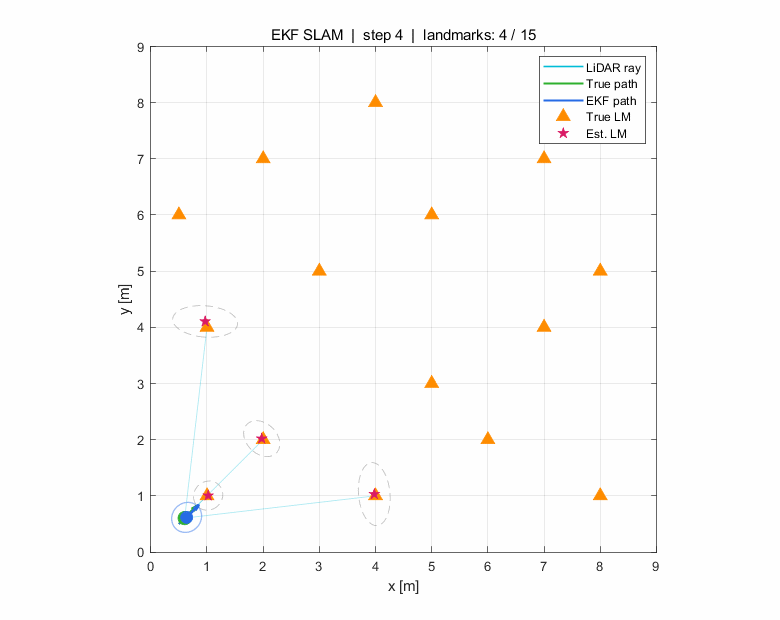
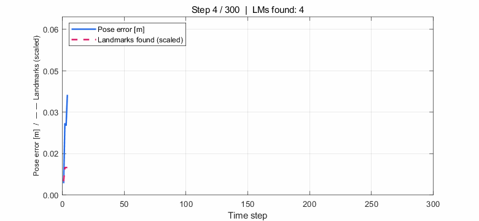
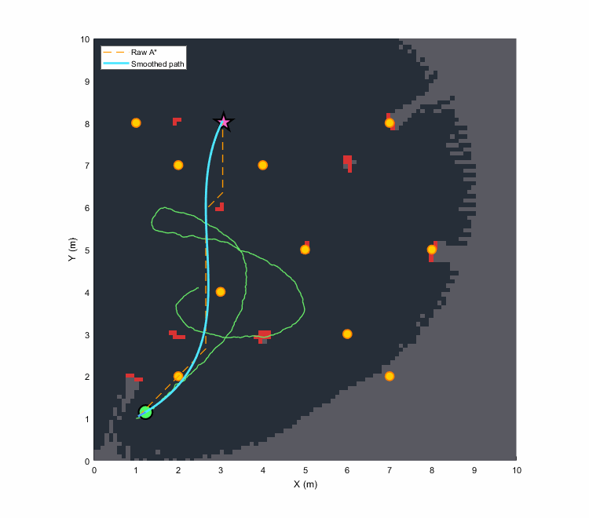
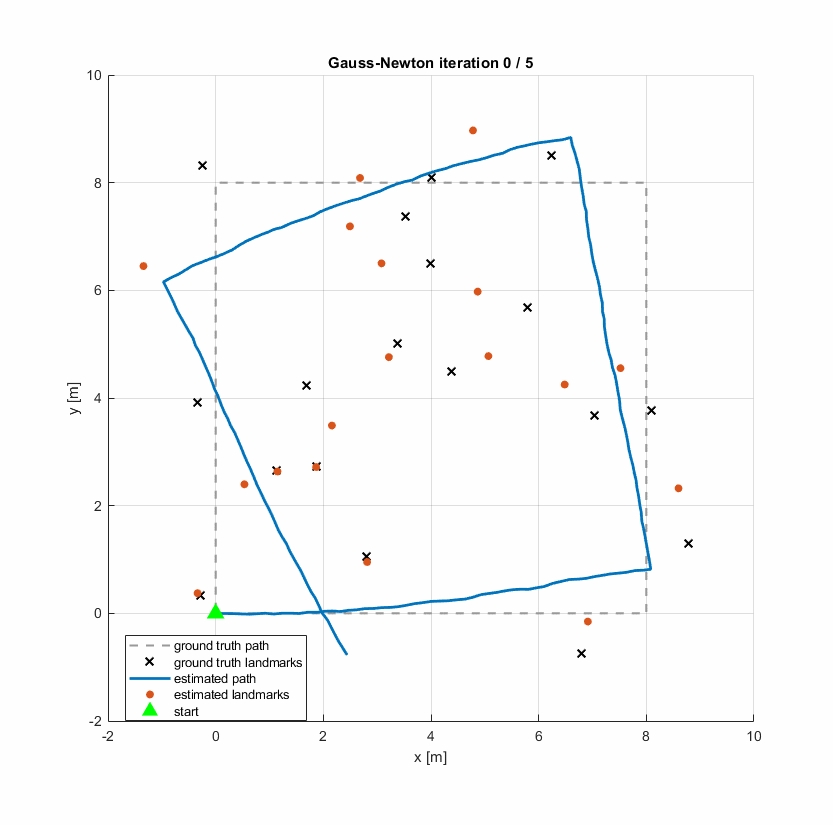
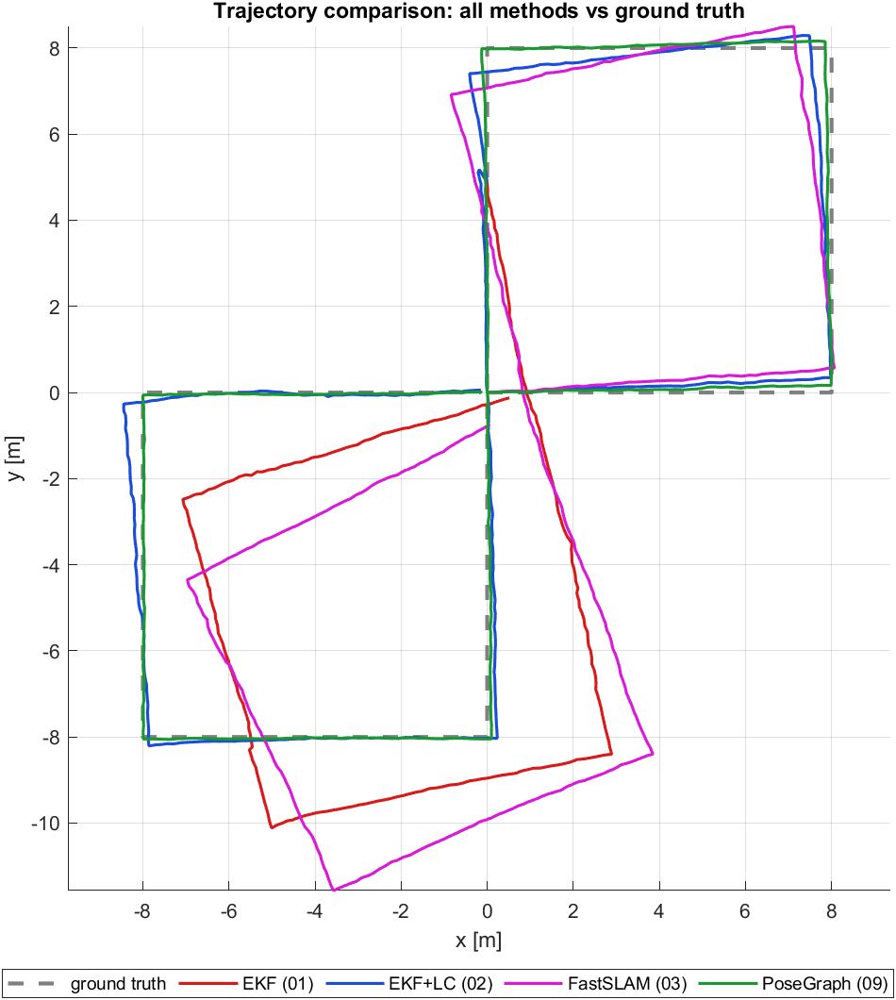
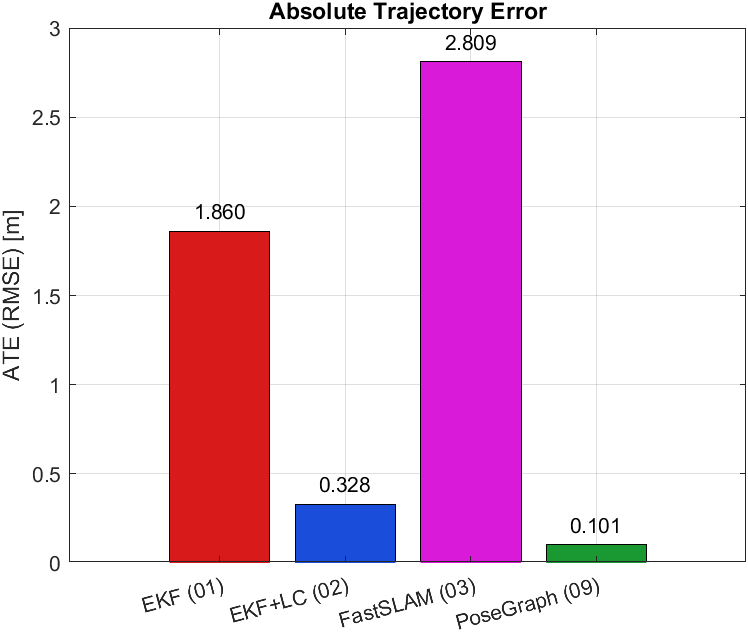
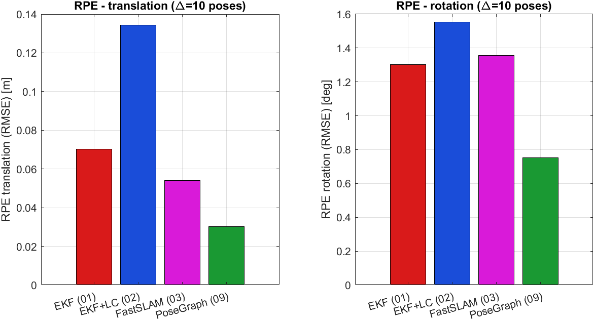
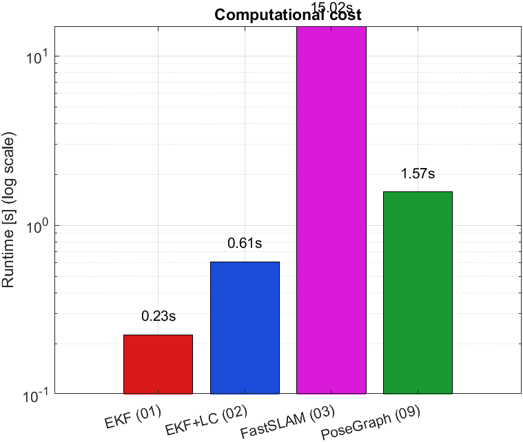
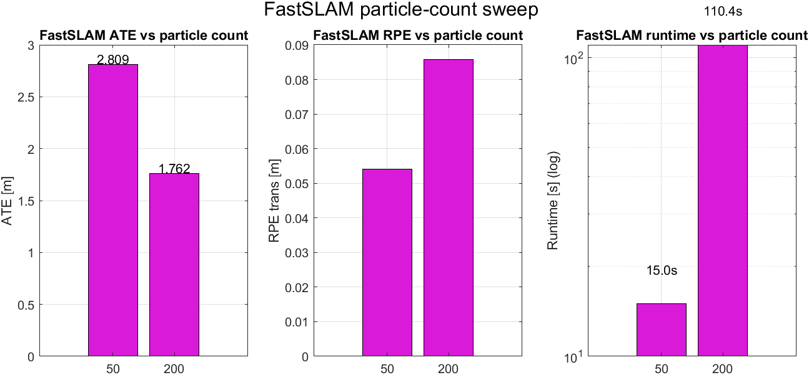
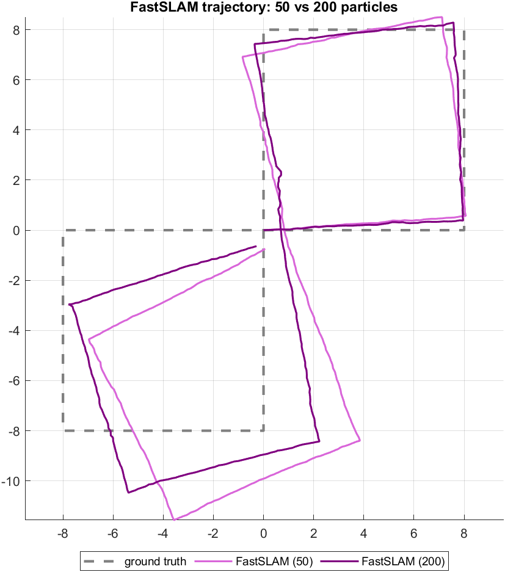

# 2D LiDAR SLAM — From a Kalman Filter to a Benchmark That Picks a Winner



I built this project to actually understand how robots figure out where they are while simultaneously building a map of their surroundings — the classic SLAM problem. Started from scratch in MATLAB with a basic Extended Kalman Filter, ended up with a live ROS 2 pipeline, A* navigation, a full autonomous patrol loop, a robot that maps an entire unknown environment with zero human input, a from-scratch nonlinear optimizer that corrects its own trajectory drift, and finally a head-to-head benchmark that runs every major method on the same problem and explains, with numbers, why the winner wins. Here's how it went.

---

## The idea

I kept watching Brian Douglas's Autonomous Navigation series and wanted to go beyond just following along. So I decided to implement each algorithm myself, debug it, break it, fix it, and only move to the next one once I genuinely understood what was happening under the hood.

Ten modules later, here we are.

---

## What's in here

### 01 — EKF SLAM
The foundation. A simulated differential-drive robot drives around a 2D environment with landmarks, using a virtual LiDAR to sense them. The Extended Kalman Filter jointly tracks the robot's pose and every landmark position in one big state vector that grows as new landmarks are discovered.

The tricky part was getting data association right — figuring out which observation corresponds to which landmark using a Mahalanobis distance gate. Get it wrong and the map corrupts itself almost immediately.



### 02 — Loop Closure Detection
Once the robot revisits a place it's been before, you can correct accumulated drift by recognising the overlap between submaps. Sounds simple. In practice, tuning the thresholds to avoid false closures is genuinely fiddly — I ended up with a cooldown timer and a minimum match count before any correction gets applied. Without those, the filter "closes the loop" 200 times in a row and the map falls apart.

### 03 — FastSLAM (Particle Filter)
Swapped the single Gaussian EKF for a particle filter where each particle carries its own landmark map. The big win is that it handles non-linear motion better and scales more gracefully with landmark count. The side-by-side comparison plot between EKF and FastSLAM trajectories is one of my favourite visualisations in the whole project — you can actually *see* where the two filters diverge.

### 04 — Occupancy Grid Mapping
Instead of tracking discrete landmarks, this module builds a dense grid of the environment using a log-odds inverse sensor model — every cell gets nudged toward free or occupied based on what the LiDAR rays pass through and hit. This grid is the foundation everything from Module 06 onward is built on.

### 05 — ROS 2 Integration
Took the EKF SLAM node and ran it live inside ROS 2 Humble on WSL2, visualised in RViz2. This one fought back the hardest — MATLAB's ROS 2 bridge just doesn't talk to WSL2 reliably over DDS, so I ended up replacing it with a Python publisher running natively inside WSL2. Also discovered a stale `CYCLONEDDS_URI` setting in `.bashrc` that was silently blocking multicast the whole time. Once that was gone, everything connected first try.

### 06 — A* Navigation
Click a goal, watch the robot navigate there. The occupancy grid from Module 04 becomes the planning space, A* finds a path with an octile-distance heuristic, and a two-stage smoother (greedy shortcutting + cubic spline) turns the raw staircase path into something a real robot could actually follow.



### 07 — Full Autonomous Navigation Pipeline
Everything from 01–06 comes together. The robot maps a corridor maze in real time, plans paths through a tight centre crossing, and patrols indefinitely between goals I click on the map. Pure pursuit handles smooth cornering, and the path flashes red when it dynamically replans around something blocking the way. This was the first time the *full* autonomy loop ran end-to-end in real time.


### 08 — Frontier-Based Autonomous Exploration
The one where I stopped clicking goals entirely. The robot looks at its occupancy grid, finds **frontiers** — the boundary cells between known-free and unknown space — and picks the best one using a hybrid score (`frontier size / distance`), balancing "how much new area will this reveal" against "how far do I have to travel to get there." Then it plans a path there with A*, drives it with pure pursuit, and repeats until there's nothing left to discover.

It finished the maze at **88.2% coverage in 5475 steps** — well under a quarter of the step budget — and stopped cleanly because the remaining ~12% genuinely has no reachable entrance. No human input from start to finish.


### 09 — Pose Graph SLAM (from-scratch Gauss-Newton)
Module 02 detects loop closures and folds a correction into the EKF on the spot. This module asks a bigger question: what if you collected *every* odometry step and *every* loop closure as edges in one big graph, and optimized the whole trajectory (and the whole landmark map) at once? That's a pose graph, and solving it is what real SLAM back ends — Cartographer, ORB-SLAM, the lot — actually do.

I built the Gauss-Newton solver completely from scratch. Every pose `(x, y, theta)` and every landmark `(x, y)` is a variable in one state vector — 675 of them for a 212-pose, 18-landmark graph. Each edge type (odometry, loop closure, landmark observation) gets its own analytically-derived error function and Jacobian, assembled every iteration into a sparse information matrix `H` and gradient `b`, solving `H·dx = -b`.



On a synthetic 8m square loop where the odometry has a small systematic bias (so the loop never quite closes on its own), the solver converges in **5 iterations**: chi2 drops from 133,474 to 1,314, and trajectory drift drops from **1.33m to 0.076m ATE** — a 17x reduction.


I also wanted to know *where* that improvement was coming from. Re-running the same solver on just the pose-only sub-graph — odometry plus the single loop closure, no landmarks at all — only gets to 0.41m ATE. So in this graph, the 668 landmark observations are doing most of the heavy lifting, not the one loop closure on its own.


### 10 — Benchmark Capstone
Every module above was its own demo, with its own data and its own story. This one asks the question that ties them all together: run EKF SLAM (01), EKF + Loop Closure (02), FastSLAM (03), and Pose Graph SLAM (09) on the **exact same problem** — a figure-eight trajectory with 4 loop closures — and see what actually wins, by how much, and why.



The headline progression: **1.860m → 0.328m → 0.101m ATE** (EKF → EKF+LC → Pose Graph). Loop closure re-association alone is a 5.7x improvement; the pose graph is another 3.2x on top of that, for 18.4x total — using 1.572s of compute.



The most interesting single result, though, is that **EKF+LC's RPE gets *worse*** even as its ATE gets dramatically better (0.070m → 0.134m). ATE measures global position error; RPE measures local smoothness over short windows. EKF+LC corrects drift with a single *snap* at the revisit point — great globally, but that snap is itself a large local discontinuity. The pose graph wins on *both* metrics because its correction is spread smoothly across all 424 poses by the joint optimization — no snap, just a gentle redistribution.




FastSLAM (50 particles) came in with the *worst* ATE of the four (2.809m) and was 67x slower than plain EKF. I ran a sweep to 200 particles to check whether it was just under-resourced:




4x the particles improved ATE somewhat (2.809m → 1.762m) but made RPE *worse* (0.054m → 0.086m) and the landmark count barely moved (61 → 62), for **7.3x the runtime**. If more particles were fixing the re-association problem, the landmark count would drop toward the true 32. It doesn't — more particles just means more chances that one particle's drift happens to line up, at exponential cost. That's the textbook FastSLAM 1.0 proposal-distribution limitation, confirmed on my own data.

---

## Modules at a glance

| # | Module | Algorithm | Key concept |
|---|--------|-----------|-------------|
| 01 | [EKF SLAM](01_ekf_slam/) | Extended Kalman Filter | Joint pose + map covariance |
| 02 | [Loop Closure](02_loop_closure/) | EKF + submap matching | Drift correction on revisit |
| 03 | [FastSLAM](03_fastslam/) | Particle filter + per-LM EKF | O(M·N) vs O(N²) |
| 04 | [Occupancy Grid](04_occupancy_grid/) | Log-odds inverse sensor model | Dense free/occupied map |
| 05 | [ROS 2 Integration](05_ros2_integration/) | EKF SLAM node | Live sensor pipeline |
| 06 | [A* Navigation](06_astar_navigation/) | A* + path smoothing | Click-to-navigate on SLAM map |
| 07 | [Autonomous Navigation](07_autonomous_navigation/) | Pure pursuit + dynamic replan | Full patrol pipeline |
| 08 | [Frontier Exploration](08_frontier_exploration/) | Frontier detection + hybrid scoring | Robot picks its own goals |
| 09 | [Pose Graph SLAM](09_pose_graph_slam/) | From-scratch Gauss-Newton PGO | Backend that *uses* loop closures |
| 10 | [Benchmark Capstone](10_benchmark_capstone/) | Same dataset, 4 methods, ATE/RPE/runtime | Which one wins, and why |

---

## How the modules connect

```
EKF SLAM (01)
  └─ + Loop closure (02)            ← fixes unbounded drift
       └─ FastSLAM (03)             ← better with many landmarks
            └─ Occupancy grid (04)  ← dense map for navigation
                 ├─ ROS 2 (05)      ← real sensors + RViz2
                 ├─ A* (06)         ← click a goal, watch it go
                 │    └─ Autonomous patrol (07)   ← full loop, clicked goals
                 │         └─ Frontier exploration (08) ← robot picks its own goals
                 └─ Pose graph SLAM (09) ← finally *uses* the loop closures from 02

01 + 02 + 03 + 09 ──────────────────────────────────────────────► Benchmark Capstone (10)
                     same dataset, same metrics, one winner
```

Module 08 quietly drops the EKF landmark tracking that powers 01–07 — more on that below. Module 09 picks it back up: the landmarks from 01/03 and the loop closures from 02 finally become inputs to an actual optimization problem, instead of just being detected and patched in real time. Module 10 closes the loop on the whole series: 01, 02, 03, and 09 all run on one shared dataset, so the comparisons in the table below aren't anecdotal — they're measured.

---

## Quick start

```matlab
% Module 01 — EKF SLAM
cd 01_ekf_slam
ekf_slam_main

% Module 06 — A* Navigation (interactive)
cd ../06_astar_navigation
astar_navigation_main
% → wait for map to build, then click a goal

% Module 07 — Autonomous patrol (interactive)
cd ../07_autonomous_navigation
autonomous_nav_main
% → click 3 patrol goals, press Enter, screen-record

% Module 08 — Frontier exploration (fully autonomous, no input)
cd ../08_frontier_exploration
frontier_exploration_main
% → just watch

% Module 09 — Pose Graph SLAM (fully autonomous, no input)
cd ../09_pose_graph_slam
pose_graph_slam_main
% → watch the convergence animation, then optionally:
test_pgo_toy_graph
% → standalone ground-truth recovery check, no toolbox needed

% Module 10 — Benchmark Capstone (fully autonomous, no input)
cd ../10_benchmark_capstone
benchmark_main
% → ~1.5-2 min total, the 200-particle FastSLAM sweep is the slow part
```

```bash
# Module 05 — ROS 2 node (WSL2 + ROS 2 Humble)
cd 05_ros2_integration
# See SETUP_GUIDE.md inside for full steps
```

---

## Things I learned the hard way

**MATLAB quirks:**
- `for ~=` is invalid — `~` only works as a function output discard
- `yyaxis` silently hijacks the colour cycle and breaks legend colours — fix with explicit `gobjects` handle arrays
- `getframe()` captures blank frames with OpenGL in R2024a — use `print() → PNG → imwrite()` instead
- Nested `function` blocks in a script file can't see script-level variables — either split into separate `.m` files or inline the math. Hit this one twice in Module 08 alone.
- Coordinate row conventions aren't consistent between MATLAB's `image()` (row 1 = top) and natural grid indexing (row 1 = bottom) — mixing them sends path planners checking the wrong cells

**ROS 2 / WSL2:**
- MATLAB's ROS 2 bridge doesn't reliably connect over DDS from Windows to WSL2 — replaced with a Python publisher running natively inside WSL2
- A stale `CYCLONEDDS_URI` loopback entry in `.bashrc` silently blocks multicast
- Node startup order matters: static TF → EKF node → RViz2 → Python bridge

**Navigation:**
- Pre-seeding the log-odds grid with walls before any LiDAR runs is essential — otherwise the planner happily routes straight through walls on step 1
- Pure pursuit with a short lookahead (0.4–0.45m) tracks corners much better than waypoint stepping — curvature-based speed scaling is key
- Loose data association thresholds cause false loop closures that corrupt the entire map in seconds

**Frontier exploration:**
- EKF point-landmark SLAM and long straight walls do **not** mix. Every beam along a wall looks like a "new" landmark, the state vector explodes before the robot leaves the first room, and the O(landmarks) update loop grinds to a crawl. Module 08 dropped EKF landmarks entirely in favour of dead-reckoning + the occupancy grid — ~30x faster and the map stopped getting wall-smear artefacts as a bonus.
- A robot that picks its own goals will eventually pick one that's unreachable, or drift its estimated position into a wall it thinks is free. Needed a stuck-counter, a blacklist with expiry, and a "spiral outward until you find a free cell" recovery before it stopped looping in place forever.
- 88% coverage on a maze like this is actually close to the ceiling — the last bit of grey is rooms with no navigable entrance within the obstacle inflation radius. The robot correctly gave up rather than spinning forever looking for frontiers that don't exist.

**Pose graph optimization (Module 09):**
- The single most time-consuming bug was a transpose error in the gradient accumulation: `(J'*Omega*err)'` looks almost right but is dimensionally wrong when `err` is a row vector — needs to be `J'*Omega*err'` (transpose `err` to a column *first*). MATLAB's "Incorrect dimensions for matrix multiplication" error pointed straight at it, but it's an easy one to write without noticing.
- Pose graphs have a **gauge freedom** — the whole graph can be rigidly rotated/translated without changing any edge error, which makes `H` singular unless something is pinned down. Anchoring pose 1 with a large prior on the diagonal of `H` fixes this with one line, but skipping it gives a solver that "converges" to nonsense.
- MATLAB's `optimizePoseGraph` (Navigation Toolbox) turned out not to be available on this install, and it only handles pose-pose edges anyway — no concept of landmark nodes. Rather than depend on it, I wrote a standalone **ground-truth recovery test**: a tiny noise-free graph where every edge is exactly consistent with a known answer, so the true optimum has chi2 = 0. The solver recovered it to chi2 ≈ 1e-26 and position errors ≈ 1e-15 — basically machine precision, and a toolbox-independent way to prove the Jacobians are *exactly* right, not just close enough.

**Benchmark capstone (Module 10):**
- Building one shared dataset that EKF SLAM, EKF+LC, FastSLAM, and the pose graph all consume identically was more work than any single algorithm, but it's the difference between "I think the pose graph is better" and "the pose graph is 18.4x better than plain EKF on the identical problem, here's the table."
- ATE and RPE can disagree, and when they do it's informative rather than a bug: EKF+LC improved ATE by 5.7x but made RPE *worse* — a single drift-correcting "snap" is great for global accuracy and bad for local smoothness. The pose graph wins both because its correction is spread across the whole trajectory instead of happening at one instant.
- The FastSLAM particle sweep (50 → 200) was the most informative negative result in the project: ATE improved a little, RPE got worse, the landmark count barely moved, and runtime went up 7.3x. That combination — not "it's slow" alone — is what actually demonstrates the FastSLAM 1.0 proposal-distribution problem rather than just an under-tuned parameter.

---

## Requirements

- MATLAB R2024a, Image Processing Toolbox, Robotics System Toolbox, Navigation Toolbox, Computer Vision Toolbox, Sensor Fusion and Tracking Toolbox
- Python 3.10+, numpy, scipy (Module 05)
- ROS 2 Humble, RViz2 (Module 05)
- Note: Module 09's from-scratch optimizer has no toolbox dependencies at all. Navigation Toolbox is only used for an optional sanity-check comparison, and the module degrades gracefully (with a console message) if it isn't available. Module 10 reuses Module 09's optimizer and has the same lack of dependency.

---

## References

1. Thrun, Burgard, Fox — *Probabilistic Robotics* (2005)
2. Montemerlo et al. — "FastSLAM: A Factored Solution to the SLAM Problem" (2002)
3. Moravec & Elfes — "High Resolution Maps from Wide Angle Sonar" (1985)
4. Brian Douglas — Autonomous Navigation series (YouTube / MATLAB)
5. Yamauchi — "A Frontier-Based Approach for Autonomous Exploration" (1997)
6. Grisetti, Kummerle, Stachniss, Burgard — "A Tutorial on Graph-Based SLAM" (2010)
7. Sturm et al. — "A Benchmark for the Evaluation of RGB-D SLAM Systems" (2012) — ATE/RPE definitions used in Module 10